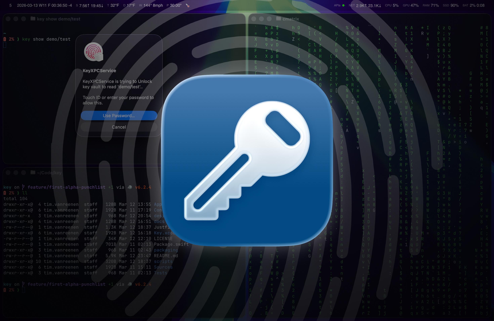

# Key



`key` is a macOS secret manager for people who like what the venerable [`pass`](https://www.passwordstore.org/) gets right:

- Secrets are stored as encrypted files, not in an opaque, app-specific database
- Flexible directory structure lets you organize and reason about secrets hierarchically
- Small, CLI-first command set with full flexibility from the shell

`key` uses the same model, but instead of pass’s GPG agent workflow, it relies on native macOS encryption and authentication. This means secrets can be unlocked with Touch ID, Apple Watch, or your system password through [`userPresence`](https://developer.apple.com/documentation/security/secaccesscontrolcreateflags/userpresence).

## How it works

- Each secret is stored as an individually encrypted file on disk, under `~/Library/Application Support/key/vault`.
- All secret files are encrypted and decrypted using a single, randomly generated 256-bit symmetric vault key.
- That vault key is stored securely in your macOS Keychain (not the secrets themselves!).
- Access to the vault key in Keychain is protected by macOS local authentication—Touch ID, Apple Watch, or your system password—using [`userPresence`](https://developer.apple.com/documentation/security/secaccesscontrolcreateflags/userpresence).
- Whenever you unlock a secret, `key` retrieves the vault key from Keychain (prompting for authentication), then uses it to decrypt the requested secret file.

The result: your secrets stay encrypted on the filesystem, protected by a single key, and only you can access that key thanks to native macOS authentication.

## Install

Install via Homebrew from the [tvanreenen/tap](https://github.com/tvanreenen/homebrew-tap) tap:

```bash
brew tap tvanreenen/tap
brew install --cask key
```

> [!WARNING]
> `key` is still in early development. There is not a public release yet.

## CLI

The CLI is intentionally small:

```bash
# Creating and refreshing secrets
key add <name>                  # add a new secret
key edit <name>                 # update an existing secret
# Listing and retrieving secrets
key list                        # list stored secrets
key show <name> [--copy]        # write a secret to stdout
# Organizing and removing secrets
key copy <src> <dst> [--force]  # copy a secret to a new name
key move <src> <dst> [--force]  # move a secret to a new name
key remove <name> [--force]     # remove a secret
```

## Generating passwords

Unlike most password managers, `key` does not include a built-in password generator. Instead, it is designed to accept input via stdin, so you can add or edit secrets either by securely typing them in (using your terminal's secure input), or by piping in passwords generated by any tool or method you prefer:

```bash
openssl rand -base64 32 | key add aws/prod/token
openssl rand -hex 32 | key add api/key
pwgen -sy 24 1 | key edit github/personal
diceware -n 6 | key add personal/passphrase
xkcdpass -n 4 | key add outlook/work
uuidgen | key add app/token
head -c 32 /dev/urandom | base64 | key add backup/recovery
```

## Fuzzy picking with fzf

If you use [`fzf`](https://github.com/junegunn/fzf), `key list` composes cleanly with it:

```bash
key show "$(key list | fzf)"
key show "$(key list | fzf)" --copy
key edit "$(key list | fzf)"
key remove "$(key list | fzf)"
```

This stays fully optional. `key` does not depend on `fzf`, but the combination works well when you want fuzzy selection across a larger store.

## Security without the lock-in

`key` uses standard AES-256-GCM encryption with zero custom cryptography. If you have both the vault key and your `.secret` files, you're not locked in: you can decrypt your secrets using any tool that supports AES-GCM, letting you move your data or audit it without relying on the app.

**Where the files live:** Secrets are under `~/Library/Application Support/key/vault`. An entry like `github/personal` is stored as `~/Library/Application Support/key/vault/github/personal.secret`.

**Payload format:** Each `.secret` file contains a JSON object:

```json
{
  "version": 1,
  "alg": "AES.GCM",
  "nonce": "<base64-encoded 96-bit nonce>",
  "ciphertext": "<base64-encoded AES-GCM ciphertext + 16-byte auth tag>"
}
```

Without the vault key (the 256-bit secret kept in your Keychain), the file contents are completely opaque.

**How to decrypt:** To unlock a secret yourself, parse the JSON and base64-decode both `nonce` and `ciphertext`. Split the decoded ciphertext into the payload (everything except the final 16 bytes) and the authentication tag (the last 16 bytes). Decrypt the payload using the vault key and nonce with AES-256-GCM—the result will be your UTF-8 plaintext.

## Nerdy details about the macOS integration

`key` is not just a standalone CLI binary. To use the stronger macOS Keychain and user-presence path correctly, it is structured as three pieces:

1. `Key.app`
2. `key` CLI client
3. `KeyXPCService.xpc`

### `Key.app`

The host app exists primarily to give the project a proper macOS app identity, signing context, entitlements, and release shape. It is not intended to be a full GUI password manager.

### `key` CLI client

The CLI is the user-facing interface. It handles:

- command parsing
- stdin and secure prompt input
- stdout and stderr output
- clipboard writes for `--copy`

The CLI does **not** directly access the protected vault key.

### `KeyXPCService.xpc`

The XPC service is the privileged side of the system. It is launched on demand by macOS and owns:

- Keychain access
- [`userPresence`](https://developer.apple.com/documentation/security/secaccesscontrolcreateflags/userpresence)-gated vault key retrieval
- encryption and decryption
- on-disk secret file access

This split is what gives `key` native macOS integration without turning the CLI itself into the privileged actor.

Conceptually, a `show` looks like this:

1. `key show github/personal`
2. the CLI sends a request to the bundled XPC service
3. the XPC service asks macOS for access to the vault key
4. macOS enforces the Keychain item's [`userPresence`](https://developer.apple.com/documentation/security/secaccesscontrolcreateflags/userpresence) requirement through its normal local-authentication path, using whatever user-presence mechanism the OS makes available for that machine and state
5. the service decrypts the secret file
6. the CLI prints the result or copies it to the pasteboard

That is the tradeoff that makes the native macOS auth path possible while keeping the day-to-day interface CLI-first. This is intentionally macOS-specific and optimizes for native platform integration over cross-platform portability.
