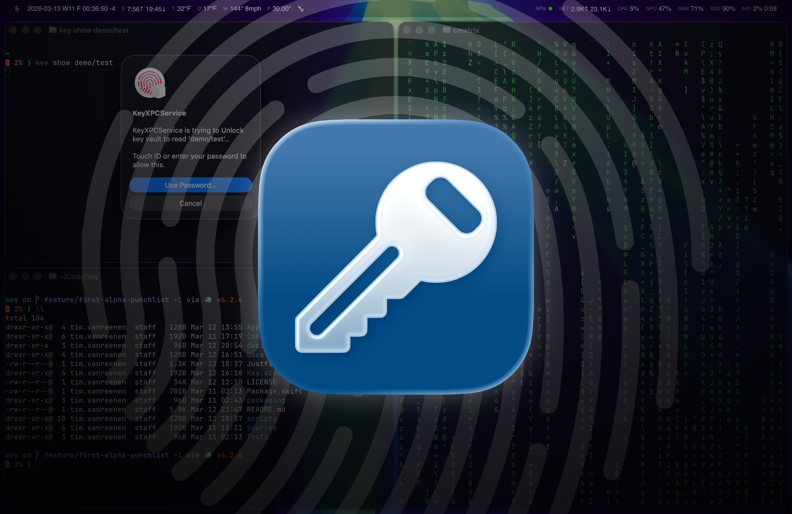

# Key



`key` is a macOS secret manager for people who like what the venerable [`pass`](https://www.passwordstore.org/) gets right:

- Secrets are stored as encrypted files, not in an opaque, app-specific database
- Flexible directory structure lets you organize and reason about secrets hierarchically
- Small, CLI-first command set with full flexibility from the shell

The difference is that, instead of pass’s GPG agent workflow, `key` handles authentication the native macOS way, using `launchd`, XPC, Mach services, [`userPresence`](https://developer.apple.com/documentation/security/secaccesscontrolcreateflags/userpresence), and Keychain.

## How it works

- Each secret is stored as an individually encrypted file on disk, under `~/.key` by default.
- All secret files are encrypted and decrypted using a single, randomly generated 256-bit symmetric vault key.
- That vault key is stored securely in your macOS Keychain (not the secrets themselves!).
- Access to the vault key in Keychain is protected by macOS local authentication—Touch ID, Apple Watch, or your system password—using [`userPresence`](https://developer.apple.com/documentation/security/secaccesscontrolcreateflags/userpresence).
- The CLI talks to an on-demand LaunchAgent helper over XPC using a Mach service.
- After a successful unlock, the helper keeps the vault key in memory for a short idle window and reuses it across separate CLI invocations without prompting again.
- When the helper has been idle long enough, it clears the in-memory key and exits.

## Install

Install via Homebrew from the [tvanreenen/tap](https://github.com/tvanreenen/homebrew-tap) tap:

```bash
brew tap tvanreenen/tap
brew install --cask key
```

Open `Key.app` once after install so it can register Key Agent with macOS before you use the `key` CLI.

## CLI

The CLI is intentionally small:

```bash
key unlock                              # authenticate and warm the helper session
key lock                                # clear the helper session and stop the helper
key status                              # explain vault health and the next safe action
key status --json                       # print stable machine-readable vault status
key get <name>                          # print a secret or current TOTP code
key copy <name>                         # copy a secret or current TOTP code
key add <name> [--totp]                 # add a new secret or TOTP seed from stdin or prompt
key edit <name> [--totp]                # update a secret or TOTP seed from stdin or prompt
key list                                # list stored secrets
key duplicate <src> <dst> [--force]     # duplicate an entry
key rename <src> <dst> [--force]        # rename an entry
key remove <name> [--force]             # remove a secret
key config get <config-name>            # print a config value
key config set <config-name> <value>    # update a config value
key config list                         # list known config values
key version [--json]                    # print the CLI version
```

## Coming in 0.2.0: secure multi-device vaults

Version 0.2.0 brings secure multi-device vaults to Key without giving up the
file-based model. You keep the encrypted vault in a folder you control, and
each Mac must be explicitly approved with keys bound to its Secure Enclave.
Your file-sync service carries encrypted, authenticated history, but it never
receives the vault key or the authority to enroll a device, silently roll back
trusted state, or choose a conflict winner.

Each Mac advances only from the exact vault state it already trusts. Missing,
substituted, rolled-back, or conflicting files therefore fail closed instead
of quietly becoming your vault. Independent edits still merge automatically;
genuine conflicts are preserved for you to inspect and resolve.

An opt-in alpha is available now:

```bash
brew install --cask tvanreenen/tap/key@alpha
```

Beginning with the next alpha, that channel installs the isolated
`Key Preview.app` and `key-preview` CLI. It can live beside Stable Key with its
own helper, configuration, default vault, and Keychain namespace, so testing a
prerelease does not replace the installation you rely on.

The next preview supports explicit migration, multiple approved Macs,
authenticated catch-up, guarded reads and writes, conflict resolution, and
owner-reviewed revocation with forward key rotation. It is not yet a stable or
complete recovery story: recovery after losing every enrolled device remains
unfinished, and the new multi-device paths still require physical release
qualification. See the
[version 3 implementation tracker](docs/v3-vault-implementation.md) for the
current scope, limitations, and release-qualification results.

## Generating passwords

Unlike most password managers, `key` does not include a built-in password generator. Instead, it is designed to accept input via stdin, so you can add or edit secrets either by securely typing them in (using your terminal's secure input), or by piping in passwords generated by any tool or method you prefer:

```bash
openssl rand -base64 32 | key add aws/prod/token
openssl rand -hex 32 | key add api/key
pwgen -sy 24 1 | key edit github/personal
diceware -n 6 | key add personal/passphrase
xkcdpass -n 4 | key add outlook/work
uuidgen | key add app/token
head -c 32 /dev/urandom | base64 | key add backup/recovery
```

## Time-based one-time passwords (TOTP)

`key` also supports calculating time-based one-time passwords. When you store a provided Base32 seed using the `--totp` flag, `key` will know to calculate TOTP using [RFC 6238](https://www.rfc-editor.org/rfc/rfc6238) each time you use the `get` or `copy` methods on that secret.

```bash
key add github/mfa --totp
key edit github/mfa --totp
key get github/mfa
key copy github/mfa
```

For now, `--totp` accepts only bare Base32 seeds and not full `otpauth://totp/Issuer:AccountName?secret=YourSecret&issuer=IssuerName` URLs. If all you are given is the full URL, just copy and store the secret from that URL. That is the bare Base32 seed that `key` expects.

## Configuration

By default, `key` stores its config in `~/Library/Application Support/Key/config.toml` and its encrypted secret files in `~/.key`.

If you want to move the vault, move the files yourself and then update the configured path:

```bash
mv ~/.key ~/Secrets/key-vault
key config set vault-dir ~/Secrets/key-vault
```

If `~/.key` already exists and contains unrelated files, Key will refuse to adopt it as the default vault root. In that case, choose another vault directory with `key config set vault-dir <path>`.

## Fuzzy picking with fzf

One the things that make retrieving secret especially efficient is using `key list` with [`fzf`](https://github.com/junegunn/fzf) to give you really strong fuzzy finding of your secrets:

```bash
key get "$(key list | fzf)"
key copy "$(key list | fzf)"
key edit "$(key list | fzf)"
key remove "$(key list | fzf)"
```

## Security without the lock-in

`key` uses standard AES-256-GCM encryption with zero custom cryptography. If you have both the vault key and your `.secret` files, you're not locked in: you can decrypt your secrets using any tool that supports AES-GCM, letting you move your data without relying on the app.

**Where the files live:** Secrets are under `~/.key` by default. An entry like `github/personal` is stored as `~/.key/github/personal.secret`. The active vault path is configured in `~/Library/Application Support/Key/config.toml` and can be inspected with `key config get vault-dir`.

**Payload format:** Each `.secret` file contains a JSON object:

```json
{
  "version": 2,
  "type": "secret",
  "alg": "AES.GCM",
  "nonce": "<base64-encoded 96-bit nonce>",
  "ciphertext": "<base64-encoded AES-GCM ciphertext + 16-byte auth tag>"
}
```

For TOTP entries, the envelope is the same except `type` is `totp`; the decrypted plaintext is the normalized Base32 seed rather than a password.

Without the vault key (the 256-bit secret kept in your Keychain), the file contents are completely opaque.

**How to decrypt:** To unlock a secret yourself, parse the JSON and base64-decode both `nonce` and `ciphertext`. Split the decoded ciphertext into the payload (everything except the final 16 bytes) and the authentication tag (the last 16 bytes). Decrypt the payload using the vault key and nonce with AES-256-GCM—the result will be your UTF-8 plaintext.

## Nerdy details about the macOS integration

`key` is not just a standalone CLI binary. To use the stronger macOS Keychain and user-presence path correctly, it is structured as three pieces:

1. `Key.app`
2. `key` CLI client
3. LaunchAgent helper

### `Key.app`

The host app exists to give the project a proper macOS app identity, signing context, entitlements, and release shape, and to register the bundled LaunchAgent helper on first launch. It is not intended to be a full GUI password manager.

### `key` CLI client

The CLI is the user-facing interface. It handles:

- command parsing
- stdin and secure prompt input
- stdout and stderr output
- clipboard writes for `key copy`

The CLI does **not** directly access the protected vault key.

### LaunchAgent helper

The helper is the privileged side of the system. It is managed by `launchd`, reachable through a Mach service, and owns:

- Keychain access
- [`userPresence`](https://developer.apple.com/documentation/security/secaccesscontrolcreateflags/userpresence)-gated vault key retrieval
- encryption and decryption
- on-disk secret file access
- the short-lived in-memory unlock session

This split gives `key` a shape that is similar in spirit to `ssh-agent` or `gpg-agent`: a user-session helper keeps unlocked key material in memory so repeated CLI commands can reuse it. The difference is that `key` uses the native macOS service model instead of a Unix socket convention:

- `launchd` starts the helper on demand
- the CLI talks to it over XPC using a Mach service
- the helper exits when it has been idle, so nothing is permanently running

That gives `key` a few nice properties:

- reliable unlock reuse across separate CLI invocations
- no long-lived decrypted secrets on disk
- no permanently running background process when idle
- native macOS process management, signing, and IPC

Conceptually, a `get` looks like this:

1. `key get github/personal`
2. if needed, `launchd` starts the helper when the CLI connects to its Mach service
3. the CLI sends a request to the helper over XPC
4. if the helper is locked, it asks macOS for access to the vault key
5. macOS enforces the Keychain item's [`userPresence`](https://developer.apple.com/documentation/security/secaccesscontrolcreateflags/userpresence) requirement through its normal local-authentication path
6. the helper decrypts the secret file
7. the CLI prints the result to stdout

Conceptually, an explicit unlock looks like this:

1. `key unlock`
2. the CLI connects to the helper's Mach service
3. if needed, `launchd` starts the helper
4. the helper asks macOS for access to the vault key
5. on success, the helper keeps the vault key in memory for a short idle window
6. later `get`, `copy`, `add`, or `edit` requests can reuse that in-memory authorization without prompting again
7. after the helper has been idle long enough, it drops the key and exits

That is the tradeoff that makes the native macOS auth path possible while keeping the day-to-day interface CLI-first. This is intentionally macOS-specific and optimizes for native platform integration over cross-platform portability.
