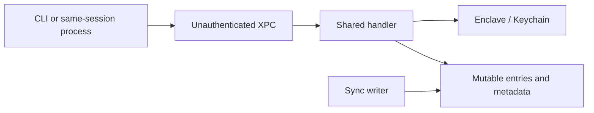

# Security Hardening Proposal: Authenticated Vault State Machine

## Decision

We need to decide whether sharing remains a collection of patched file
operations or becomes one explicit security protocol. The review supports the
latter: identity, key generation, entry generation, and durable commit should
be owned by one state machine.

## Executive Recommendation

The complete option set is:

- **Option 1: Strengthen local guards.** Add caller checks, AAD, locks, and
  focused journals to the existing structure.
- **Option 2: Versioned transaction layer.** Keep ordinary files, but commit
  authenticated immutable generations through one serialized helper engine.
- **Option 3: Signed operation log.** Model every device change as a signed,
  mergeable operation and materialize a vault view.

I recommend Option 2. It gives us a coherent failure model and revocation
protocol without requiring a distributed-log product.

## Evidence

I inspected the callers and state transitions directly. These identifiers are
defined here so the proposal remains readable:

| Evidence | Finding or observation | What it establishes |
|---|---|---|
| `CAND-001` | Unauthenticated XPC vault authority | Privileged helper capability is not bound to the intended client identity. |
| `CAND-002` | Self-authenticating enrollment code | Pairing ceremony is not bound to an independent peer observation. |
| `CAND-003` | Removal without key rotation | Membership state and cryptographic access diverge. |
| `CAND-004/006` | Rollbackable metadata and entries | Current state has no authenticated freshness root. |
| `CAND-005` | Missing entry context | A ciphertext is portable across names, types, and vaults. |
| `CAND-007/011` | Lost updates and request races | No component owns a whole vault transition. |
| `CAND-008/009/010` | Path, configuration, and migration durability | Filesystem operations do not share containment, process-state, or crash-recovery invariants. |

Observed source includes `Sources/KeyLaunchAgentHelper/main.swift`,
`Sources/KeyCore/KeyServiceHandler.swift`, `VaultKeyStore.swift`,
`VaultCipher.swift`, and `EntryStore.swift`. From those facts we infer that the
1178-line `VaultKeyStore` is carrying several protocols without a durable state
machine boundary; that inference, not file length alone, motivates this
proposal.

## Current Design And Failure Mode

The helper is the practical trust anchor because it unwraps and caches the AES
key, yet it accepts every local XPC connection and delegates to one handler.
The handler performs entry, membership, configuration, and multi-file key
transitions with different small locks and atomic file replacements. Those
controls protect bytes or individual properties, not the vault invariant as a
whole.

On the sync side, `.key-enclave.json` is both the authorization database and a
last-writer-wins file. Entries are individually authentic, but not bound to a
logical identity or current revision. We therefore have several sources of
truth—config mode, Keychain state, metadata epoch, device arrays, wrapped-key
arrays, and file contents—with no single committed generation that proves they
belong together.

## Desired Invariants

- Every helper request is authorized against the installed client's code
  requirement before privileged parsing or execution.
- Enrollment succeeds only after both devices prove possession of their keys
  and compare a short value derived from the same transcript.
- Active membership and wrapped-key eligibility are one authenticated state.
- Removing a device advances the key generation, re-encrypts entries, and
  rewraps only for the remaining active devices.
- Every entry authenticates vault ID, logical name, semantic type, format
  version, generation, and entry revision.
- One manifest commits a complete generation; restart either observes the old
  generation or resumes/commits the new one.
- All vault mutations are serialized or rejected on an expected-revision
  mismatch.
- Every filesystem sink operates on a handle proven to remain beneath the
  selected vault root.

## Constraints And Non-Goals

We preserve CLI-first operation, file portability, offline access, and local
mode. We do not attempt to protect secrets from a fully compromised currently
authorized device. We also should not claim strong multi-writer conflict-free
semantics until a merge policy is deliberately chosen and tested.

## Before Architecture

The current trust and state edges are shown in
[the before diagram](../diagrams/authenticated-vault-state-machine-before.mmd).
The important detail is that the same handler owns key access and dangerous
filesystem effects, while multiple mutable files independently describe the
current state.

## Options

### Option 1: Strengthen Local Guards

This option preserves nearly every current type and call boundary. We would add
an `NSXPCListener` code-signing requirement, a transaction mutex, AAD fields,
metadata authentication, symlink-safe opens, and a small unshare journal.
Its strongest case is delivery speed: each observed path can receive a direct
control and most CLI behavior remains unchanged.

The weakness is ownership drift. Callers would still coordinate mode, Keychain,
metadata, and entry files through convention. A new lifecycle verb could bypass
one of the local guards, and last-writer-wins sync would remain difficult to
reason about. Rollback is easy—individual patches can be reverted—but mixed old
and new formats need careful compatibility tests.

See [the Option 1 diagram](../diagrams/authenticated-vault-state-machine-local-guards-after.mmd).

| Change | Before | After | Security consequence | Cost |
|---|---|---|---|---|
| XPC admission | Accept all | Code requirement | Blocks unintended local clients | Signing/test setup |
| Entry encryption | GCM without context | AAD at call sites | Blocks swaps | Format migration |
| Migration | Catch rollback | Small journal + mutex | Narrows interruption/race risk | Recovery branches |
| State | Mutable JSON | MACed JSON | Detects edits | Key/version handling |

### Option 2: Versioned Transaction Layer

Here we keep the user-visible file vault, but change its internal write model.
An authenticated XPC boundary hands typed operations to a
`VaultTransactionEngine`. The engine reads one committed manifest, verifies its
authenticator and expected generation, stages immutable entry files and the next
manifest in a new generation directory, then commits by atomically advancing a
small root pointer. Restart can discard an uncommitted stage or resume from a
persisted transaction record.

This creates the most useful security effect: membership, key epoch, entry
context, and durability share one owner and one commit boundary. Revocation is
still expensive because all secrets must be re-encrypted, but it becomes a
defined transaction rather than an incidental loop. Serialization may delay
concurrent CLI writes; that is a good default for a small password vault, and
we can measure it before considering parallel staging.

Memory should improve relative to the current unshare path if the engine streams
one entry at a time rather than retaining all plaintexts and ciphertexts.
Disk use temporarily holds two generations, which is the price of reliable
rollback. Operations gain observable IDs and phases, making `status`, `doctor`,
resume, and conflict messages honest. Rollback simply retains the prior root
pointer until the new generation commits.

See [the Option 2 diagram](../diagrams/authenticated-vault-state-machine-versioned-transactions-after.mmd).

| Change | Before | After | Security consequence | Cost |
|---|---|---|---|---|
| Control owner | Handler/callers | Transaction engine | Invalid transitions centralized | Refactor |
| Current state | Several mutable facts | Authenticated manifest generation | Detects mismatch/rollback | New schema |
| Rekey | In-place loop | Staged streaming generation | Crash-safe commit | Temporary disk |
| Concurrency | Partial queues | Expected revision + serialization | No silent key races | Write queuing |
| Filesystem | URL joins | Root-contained handles | Prevents symlink escape | Lower-level APIs |

### Option 3: Signed Operation Log

The most ambitious option treats each device as a writer of signed operations:
add/edit/remove entry, propose/approve member, rotate epoch, and acknowledge
generation. Devices sync an append-only log and deterministically validate and
merge it into a materialized vault view.

This is attractive if multi-device offline editing and complete audit history
are primary product goals. Conflicts become explicit data rather than silent
overwrites, and signatures attribute every state transition. The concern is
that secure membership logs are consensus protocols in miniature: ordering,
forks, device clocks, compaction, tombstones, and key rotation all become
security-critical. A naive log can make rollback and split-brain behavior more
complex rather than less.

Performance would add validation over log growth; memory/disk would require an
index, checkpoints, and compaction. Operations and recovery become more
observable, but support burden rises substantially. Rollback of the software
also becomes difficult once devices emit operations older clients cannot
interpret. I would choose this only if offline concurrent writers are a
non-negotiable requirement.

See [the Option 3 diagram](../diagrams/authenticated-vault-state-machine-signed-oplog-after.mmd).

| Change | Before | After | Security consequence | Cost |
|---|---|---|---|---|
| State exchange | Files overwrite | Signed operations | Attribution and explicit conflicts | Protocol complexity |
| Merge | Provider last-writer-wins | Deterministic validator | Prevents silent loss | Fork rules |
| History | None | Checkpointed audit log | Rollback evidence | Storage/compaction |
| Compatibility | One file schema | Operation versions | Evolvable when correct | Hard rollback |

## Comparison

| Dimension | Option 1 | Option 2 | Option 3 |
|---|---|---|---|
| Security | Fixes known paths; recurrence remains | Strong central invariants | Strongest attribution; protocol risk |
| Performance | Nearly neutral | Serialized commits and staging I/O | Log validation/compaction |
| Memory | Nearly neutral | Streamable, bounded plaintext | Index/checkpoint state |
| Reliability | Better, still multi-source | Old-or-new generation recovery | Explicit conflicts, complex forks |
| Operability | Few new concepts | Transaction IDs, doctor/resume | Log inspection and compaction |
| Migration | Lowest | Moderate dual-read/generation rollout | Highest protocol transition |

No numbers here are measured. For Option 2 we should benchmark 1, 100, and
10,000-entry add/get/rekey workloads, tracking latency, peak RSS, temporary disk
amplification, and recovery time after forced termination at each commit phase.

## Recommendation

I recommend Option 2 under the current constraints. It resolves the shared
structural cause while preserving a vault a user can understand and back up.
Option 1 becomes preferable only if near-term compatibility dominates recurrence
risk. Option 3 becomes preferable if the product explicitly commits to
multi-writer offline collaboration and is willing to own a distributed protocol.

## Evidence Coverage And Residual Risk

| Evidence | Option 1 | Option 2 | Option 3 |
|---|---|---|---|
| `CAND-001` — XPC authority | addresses | addresses | addresses |
| `CAND-002` — enrollment identity | addresses tactically | addresses in protocol | addresses in signed protocol |
| `CAND-003` — revocation | mitigates | addresses transactionally | addresses with epoch operations |
| `CAND-004/006` — freshness | mitigates | addresses with manifest generation | addresses with log/checkpoints |
| `CAND-005` — entry context | addresses | addresses | addresses |
| `CAND-007/011` — concurrency | mitigates | addresses | addresses with merge rules |
| `CAND-008/009/010` — durability | mitigates | addresses | mitigates; adds new protocol risks |

Every option still needs tactical caller authentication and a safe migration
from existing v2 entry files. None can recover a vault after all authorized
Secure Enclave identities are lost unless we deliberately add a recovery
credential or escrow design.

## Migration And Rollout

For Option 2, introduce read-only parsing and verification for a v3 manifest
first. Add a `vault doctor` command and release it before any writer. Next,
enable authenticated XPC and serialize old-format mutations. Then create v3
generations behind an explicit opt-in migration that retains v2 files until the
new manifest is verified on at least one device. Only after mixed-version tests
pass should share/revoke/unshare use the transaction engine by default.

Rollback before commit keeps the old generation. After commit, rollback requires
the previous app to understand the v3 read path; therefore ship the reader one
release before the writer.

## Validation Plan

- Attempt unauthorized XPC clients with wrong team, bundle, and ad-hoc signatures.
- Simulate enrollment races and verify the SAS changes with either transcript.
- Force-kill every rekey phase and prove restart selects a complete generation.
- Replay old manifests/entries and verify authenticated generation rejection.
- Run two-device conflict tests for membership and entry revisions.
- Exercise symlink, rename, mount, and provider-placeholder path cases.
- Measure add/get/list/rekey latency, peak RSS, disk amplification, and recovery.
- Add real helper/XPC integration tests outside the current SwiftPM-only graph.

## Implementation Work Packages

- Define v3 manifest, entry AAD, generation, and transaction-state schemas.
- Add authenticated XPC admission and typed authorization policy.
- Extract enrollment into a transcript-bound protocol with independent SAS.
- Build root-contained filesystem handles and generation staging/commit.
- Implement revoke-and-rotate, streaming re-encryption, resume, and rollback.
- Add `devices`, `revoke`, `rotate`, `doctor`, transaction `status`, and recovery
  UX before enabling shared mode by default.

## Open Questions

- Is a single active writer acceptable, or must offline concurrent editing merge?
- What recovery story is acceptable if all enclave identities are lost?
- Can file providers preserve atomic directory/root-pointer semantics reliably?
- Should the CLI expose JSON/NUL output and explicit conflict exit codes?
- What vault size and rekey latency define an acceptable release gate?
